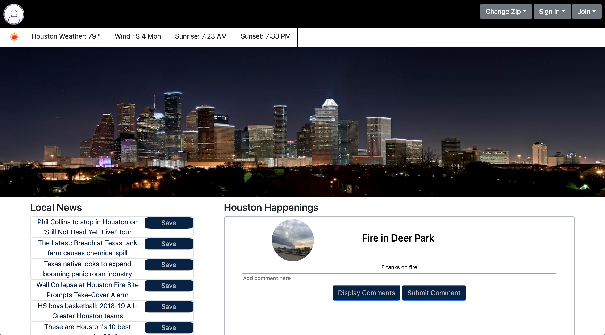
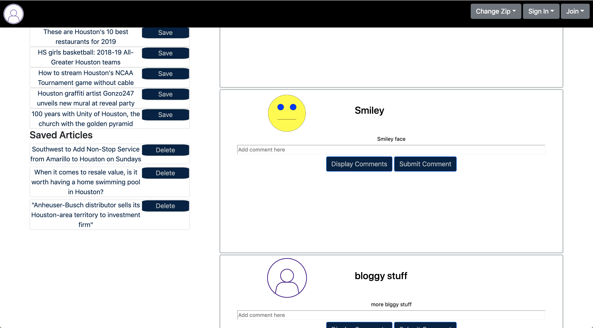
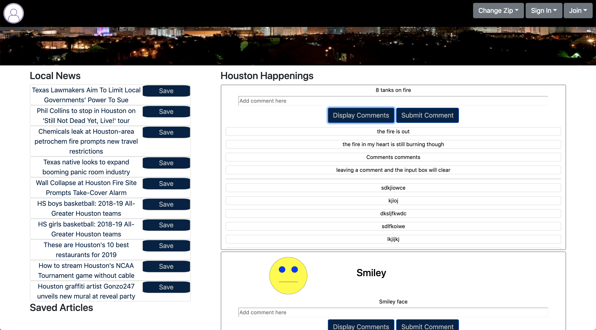
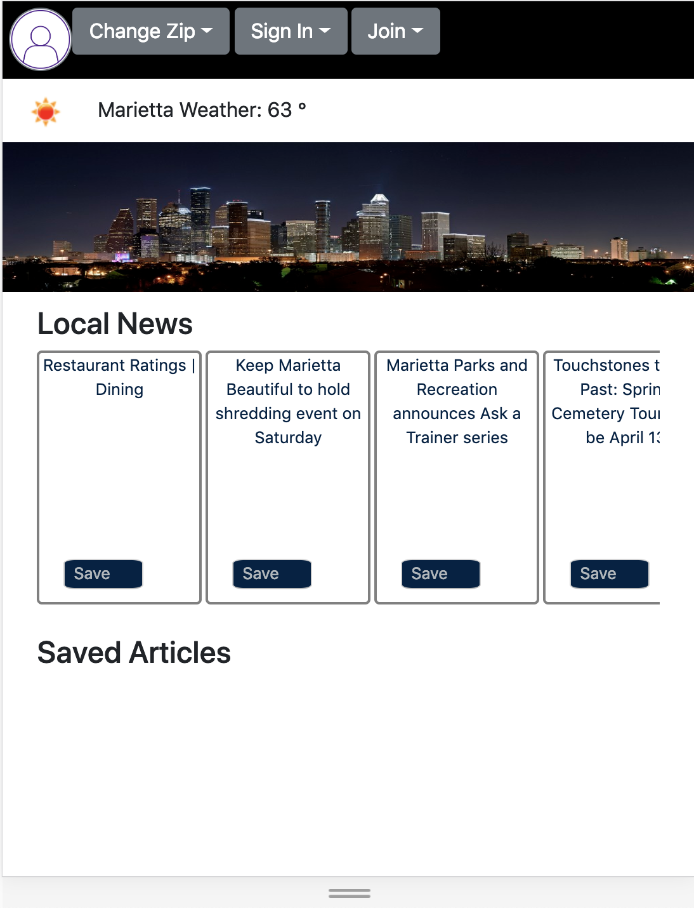
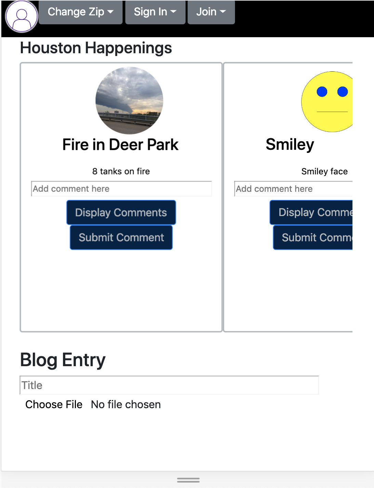
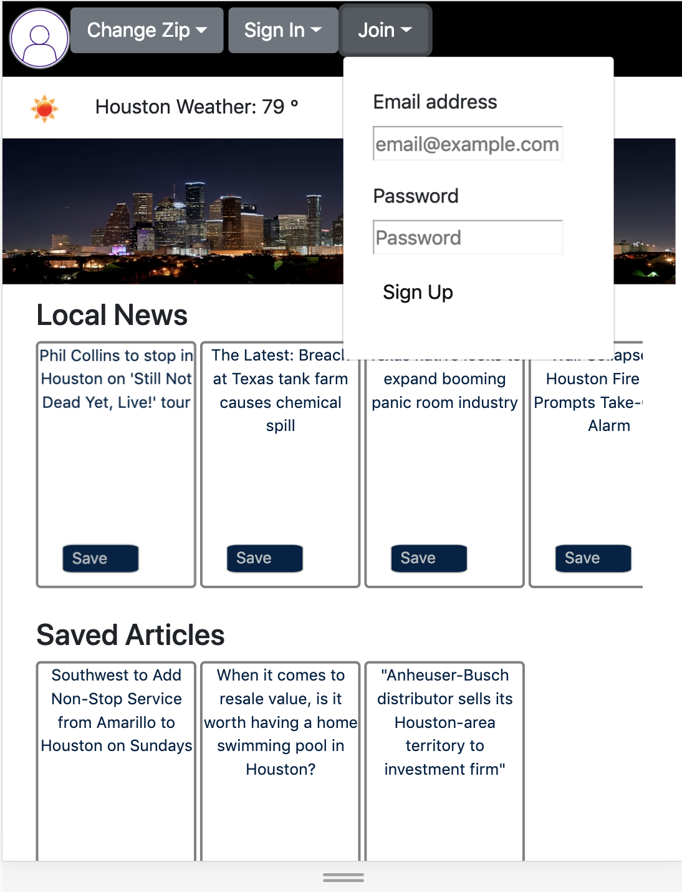
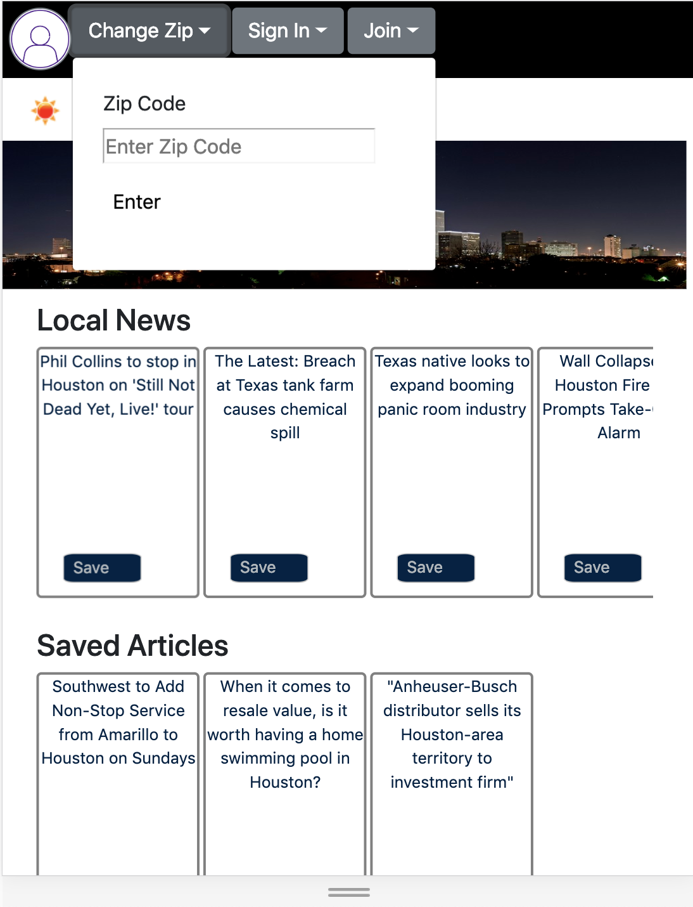

# ProjectSTAR
Digital Crafts group project with Steve, Tiffany, Audi, and Richard. 
**Check out the project at coherent-beast.surge.sh**
******************************************************************************************************************************

**Background:**

During the Digital Crafts boot camp, we were assigned our first project, which was to incorporate HTML, CSS styling, JavaScript, and Google's Firebase. We agreed a news blog would allow us to bring all these elements together, along with an API, user authentication, and a dynamically changing news feed based on the zipcode you provide.

# How It Works

**User Sign In and Sign Up:**

  
On the right-hand side, users can access a dropdown menu to either Join or Sign In. By joining, users are able to saved news articles to their login information. When they log back in, they can retrieve the saved articles at any time.

**Saved News Articles:**

The saved news articles will appear under the local news articles. Base users do not have rights to create blogs, but they are allowed to comment on them. 

The main menu bar goes with you as you scroll, so you never have to scroll back up in order to use the menu.

# Mobile Application 

**Responsive Design:**

Responsive design can be the hardest part of designing any webpage or application. Determining how a user will scroll and view the page without log columns of entries was the main challenge. The idea of putting the news articles and the blogs inside of scrolling boxes was discussed, and we made the boxes scroll horizontally so the user never gets stuck while scrolling vertically.

The blogs function on mobile similarly as they do on desktop, and the scroll box will allow for vertical scrolling when comments are displayed. Comments get displayed below the submit button. The blogs were placed at the bottom of the mobile page to avoid users accidentally scrolling inside a scroll box when they intended to scroll through the page.

**Drop Downs:**

The navbar was adjusted to accomidate the buttons and dropdowns without any conflicts with a smaller screen size. 

**News and Weather:**

In desktop view, the header has a weather display which incorporates extra data such as wind speed and when the sun will rise and set. On mobile, the eather display has been reduced to just the temperature for a cleaner display.

The saved articles, like before, appear under the local news and inside of a horizontal scrolling box.

By using the zipcode dropdown menu, users are able to input a zipcode and get local news and weather from the area. The image on the left of the weather menu changes based on the weather conditions.
